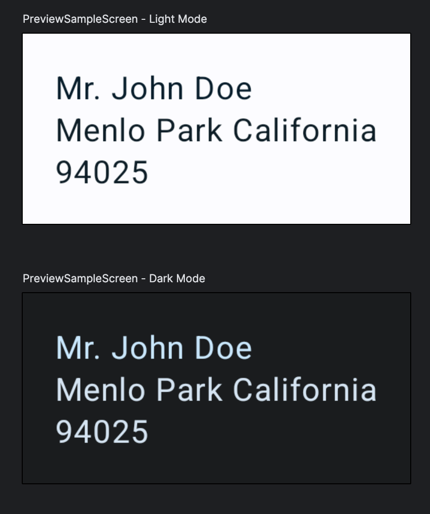

# Mock Preview
[](https://central.sonatype.com/artifact/io.github.kdani41/mock-preview/)

### Description
Light weight library based of [mockk](https://mockk.io/) for supporting mocks in [compose preview](https://developer.android.com/develop/ui/compose/tooling/previews).

Special thanks to contributors at [mockk](https://mockk.io/)

### Features
- Allows to mock objects for compose previews.

### Operators Map
|      Mock Preview	       |    Mockk    |        Description	         |
|:------------------------:|:-----------:|:---------------------------:|
|       mockPreview        |    mockk    | for mocking regular classes |
|    mockPreviewObject     | mockkObject | for mocking object classes  |
|         forThis          |    every    |  for returning stub values  |

### Installation
```kotlin 

dependencies {
    debugImplementation("io.github.kdani41:mock-preview:[version]")
    releaseImplementation("io.github.kdani41:mock-preview-no-op:[version]")
}

```

### [Usage](https://github.com/kdani41/mock-preview/tree/main/sample/src/main/java/com/kdani/mockpreview)
#### SampleScreen.kt
```kotlin 

@Composable
@Preview(name = "Light Mode", showBackground = true)
@Preview(name = "Dark Mode", uiMode = Configuration.UI_MODE_NIGHT_YES, showBackground = true)
fun PreviewSampleScreen() {
    val analytics = mockPreview<Analytics>()
    val dataSource = mockPreview<DataSource> {
        forThis { title } returns "Mr. John Doe"
        forThis { address } returns "Menlo Park California"
    }
    mockPreviewObject(SampleInput)
    forThis { SampleInput.input } returns "94025"
    val sampleScreen = SampleScreen(analytics, dataSource)
    MockPreviewTheme {
        sampleScreen.Render()
    }
}

```
#### SampleOutput.kt

